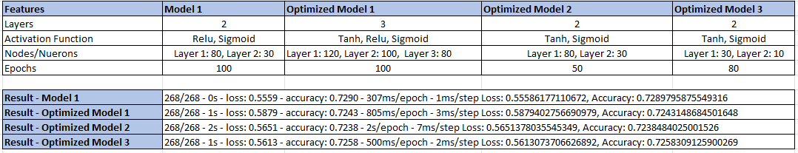

# Report on the Neural Network Model for Alphabet Soup

## Overview of the Analysis

The purpose of this analysis is to develop a deep learning model for Alphabet Soup, an organization that funds various philanthropic ventures. The organization wants to predict which applicants are likely to be successful if funded based on a set of input features. The goal is to optimize the allocation of funds to maximize the success rate of funded projects.

## Results

### Data Preprocessing

**Target Variable:**

-   The target variable for the model is "IS_SUCCESSFUL." This binary variable indicates whether an applicant's project was successful (1) or not (0).

**Feature Variables:**

-   The feature variables for the model include various input features such as "APPLICATION_TYPE," and "CLASSIFICATION," for the models deployed in this exercise. These features are used to predict the success of the funding applicants.

**Removed Variables:**

-   Seveeral columns such as the "EIN" (Employer Identification Number) , "SPECIAL_CONSIDERATIONS", "STATUS" and "NAME" were removed from the input data. These columns are neither targets nor features and do not provide relevant information for predicting success.

### Compiling, Training, and Evaluating the Model

**Model Architecture:**

Model Architectures:
## Model 1:

- Layers: 2
- Activation Functions: Relu, Sigmoid
- Neurons: Layer 1: 80, Layer 2: 30
- Epochs: 100
- Results: Loss - 0.5559, Accuracy - 0.7290

## Optimized Model 1:

- Layers: 3
- Activation Functions: Tanh, Relu, Sigmoid
- Neurons: Layer 1: 120, Layer 2: 100, Layer 3: 80
- Epochs: 100
- Results: Loss - 0.5879, Accuracy - 0.7243

## Optimized Model 2:

- Layers: 2
- Activation Functions: Tanh, Sigmoid
- Neurons: Layer 1: 80, Layer 2: 30
- Epochs: 50
- Results: Loss - 0.5651, Accuracy - 0.7238

## Optimized Model 3:

- Layers: 2
- Activation Functions: Tanh, Sigmoid
- Neurons: Layer 1: 30, Layer 2: 10
- Epochs: 80
- Results: Loss - 0.5613, Accuracy - 0.7258
- 
Model Performance:
Model 1 had two layers with Relu and Sigmoid activation functions and achieved an accuracy of approximately 72.90%.
Optimized Model 1 introduced an additional layer and increased the number of neurons in each layer but performed slightly worse with an accuracy of approximately 72.43%.
Optimized Model 2, with two layers and different activation functions, achieved an accuracy of approximately 72.38%.
Optimized Model 3 had fewer neurons in each layer but achieved a slightly better accuracy of approximately 72.58%.

Model Performance and Target:
None of the models achieved a significantly higher accuracy than Model 1 (the baseline model). The differences in performance were relatively minor.

**Neurons, Layers, and Activation Functions:**

The neural network model is a key component of this analysis. The architecture of the neural network includes:
    -   Input layer with a number of neurons equal to the number of input features.
    -   One or more hidden layers with a varying number of neurons.
    -   An output layer with a single neuron (binary classification) using a sigmoid activation function.
    -  The choice of the number of neurons and layers depends on the complexity of the problem. The activation functions used in hidden layers are typically ReLU (Rectified Linear Unit) to introduce non-linearity - detailed inputs are shown under the Summary Section. 

**Steps to Improve Model Performance:**

I tried binning the application types and classification types for these apps into different numerical categories in each model to see if it would make a difference in the accuracy or loss of the model to predict success - but that did not seem to make a difference. 

**Achieving Target Model Performance:**

Based on the table above, despite manipulating different features in each model, the results did not successfully reach a model that had an accuracy over 75%.

## Summary

In summary, the deep learning model developed for Alphabet Soup is designed to predict the success of funding applicants based on various input features. The model's architecture includes input, hidden, and output layers with appropriate activation functions as listed above. The model's performance did not meet target performance which was to have a model with an accuracy over 75% - all models had an accuracy of under 73%

## Recommendation:

While a deep learning model is a suitable approach for this classification problem, an alternative recommendation is to explore other machine learning models, such as random forests, gradient boosting, or logistic regression. These models are interpretable and may provide insights into the key factors affecting project success. Additionally, feature importance can be extracted from these models to understand the contribution of each feature. Exploring different models and ensemble methods can provide a comprehensive understanding of the data and potentially improve prediction accuracy. It's essential to choose the model that best aligns with Alphabet Soup's goals and interpretability requirements.

